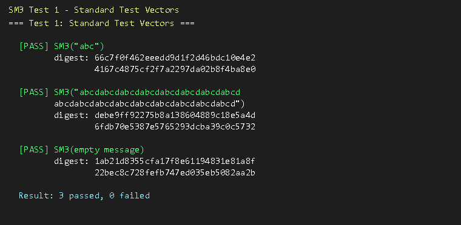
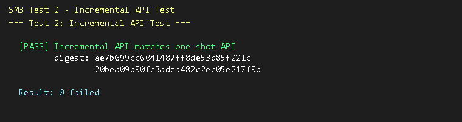
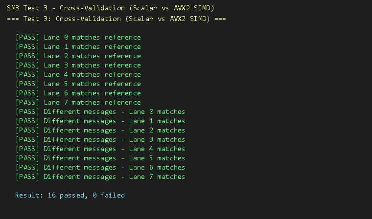
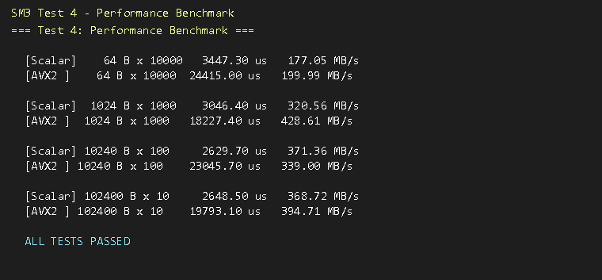

# SM3密码杂凑算法SIMD优化实现 — 实验报告

## 一、实验背景

### 1.1 SM3算法概述

SM3是中国国家密码管理局于2010年发布的密码杂凑算法标准（GM/T 0004-2012），
是我国商用密码体系中的重要组成部分。SM3输出256位（32字节）的杂凑值，
广泛应用于数字签名、消息认证码、随机数生成等密码学场景。

**SM3算法核心结构：**

SM3采用Merkle-Damgård迭代结构，包含以下主要步骤：

1. **消息填充（Padding）**：在消息末尾追加bit "1"、若干bit "0"以及64位原始消息长度，
   使得填充后总长度为512的倍数。

2. **消息扩展（Message Expansion）**：将每个512位消息块B扩展为132个32位字：
   - W[0..15] = B的分组
   - W[j] = P₁(W[j-16] ⊕ W[j-9] ⊕ (W[j-3] <<< 15)) ⊕ (W[j-13] <<< 7) ⊕ W[j-6], j=16..67
   - W'[j] = W[j] ⊕ W[j+4], j=0..63

3. **压缩函数（Compression Function）**：对每个消息块执行64轮迭代：
   - SS1 = ((A <<< 12) + E + (Tⱼ <<< (j mod 32))) <<< 7
   - SS2 = SS1 ⊕ (A <<< 12)
   - TT1 = FFⱼ(A, B, C) + D + SS2 + W'ⱼ
   - TT2 = GGⱼ(E, F, G) + H + SS1 + Wⱼ
   - 状态更新：A←TT1, B←A, C←B<<<9, D←C, E←P₀(TT2), F←E, G←F<<<19, H←G

4. **输出**：最终8个状态字经异或后输出为256位杂凑值。

### 1.2 SIMD优化背景

传统的标量实现一次只能处理一条消息，无法充分利用现代CPU的SIMD（Single Instruction
Multiple Data）并行计算能力。本实验分别针对x86架构（AVX2指令集，256位寄存器）
和ARM64架构（NEON指令集，128位寄存器）实现了SIMD优化，同时采用
**SIMD寄存器与通用寄存器混合**的优化策略，兼顾并行效率与代码灵活性。

| 特性 | x86 AVX2 | ARM64 NEON |
|------|----------|------------|
| SIMD寄存器宽度 | 256-bit (YMM) | 128-bit (Q) |
| 并行消息数 | 8路 (8×32bit) | 4路 (4×32bit) |
| 寄存器数量 | 16个YMM | 32个Q |
| 指令格式 | 二操作数 | 三操作数 |

---

## 二、实现方式

### 2.1 项目结构

```
lab2/
├── sm3.h              # 通用头文件
├── sm3_ref.c          # 标量参考实现（通用寄存器版本）
├── sm3_avx2.c         # x86 AVX2 SIMD优化（8路并行）
├── sm3_neon.c         # ARM64 NEON SIMD优化（4路并行）
├── sm3_test.c         # 测试程序
├── Makefile           # 编译构建系统

```

### 2.2 混合优化策略

本实验的核心创新点是**SIMD寄存器与通用寄存器的混合使用**：

| SIMD寄存器 (YMM/Q) | 通用寄存器 (GPR) |
|---|---|
| 8路(A~H)状态并行更新 | 消息扩展标量计算 |
| 布尔函数 FFj/GGj | 内存地址寻址 |
| 置换函数 P0/P1 | 循环控制 |
| 32位加法、异或、循环移位 | 轮常量加载 |
| 轮常量广播 | 消息填充管理 |

**为什么使用混合策略？**

1. **消息扩展适合通用寄存器**：消息扩展公式 W[j] = P₁(W[j-16] ⊕ W[j-9] ⊕ (W[j-3] <<< 15))
   ⊕ (W[j-13] <<< 7) ⊕ W[j-6] 涉及跨索引的复杂依赖关系，不同lane的W值各不相同，
   使用标量指令逐消息计算反而更高效。

2. **压缩轮函数适合SIMD寄存器**：64轮压缩迭代中，每一轮对8个状态变量执行相同的
   移位、异或、加法操作。这些操作天然适合SIMD并行——在AVX2下一次处理8条消息，
   在NEON下一次处理4条消息。

3. **寄存器分配优化**：现代CPU的SIMD和通用寄存器是独立的物理寄存器文件，
   混合使用可以最大化寄存器资源利用率，避免寄存器溢出（spill）到内存。

### 2.3 AVX2 SIMD实现细节

#### 消息布局

8条独立消息的状态变量在YMM寄存器中的布局：

```
YMM寄存器为256位宽，由8个32位lane组成，每个lane保存一条独立消息的一个状态字：

| Lane 0 | Lane 1 | Lane 2 | Lane 3 | Lane 4 | Lane 5 | Lane 6 | Lane 7 |
|---|---|---|---|---|---|---|---|
| 32-bit | 32-bit | 32-bit | 32-bit | 32-bit | 32-bit | 32-bit | 32-bit |

8个YMM寄存器分别保存8条消息的A~H共8个状态变量。
```

#### 关键SIMD操作实现

```c
/* 8路32位循环左移（使用shift+or模拟，AVX2无原生rotate） */
static inline __m256i mm256_rotl32(__m256i x, int n) {
    __m256i left  = _mm256_slli_epi32(x, n);       /* VPSLLD */
    __m256i right = _mm256_srli_epi32(x, 32 - n);   /* VPSRLD */
    return _mm256_or_si256(left, right);             /* VPOR   */
}

/* FFⱼ(X,Y,Z): 前16轮为XOR，后48轮为多数函数 */
static inline __m256i mm256_FF(int j, __m256i x, __m256i y, __m256i z) {
    if (j < 16)
        return _mm256_xor_si256(_mm256_xor_si256(x, y), z);  /* VPXOR */
    else {
        /* (X∧Y) ∨ (X∧Z) ∨ (Y∧Z) */
        __m256i xy = _mm256_and_si256(x, y);   /* VPAND */
        __m256i xz = _mm256_and_si256(x, z);
        __m256i yz = _mm256_and_si256(y, z);
        return _mm256_or_si256(_mm256_or_si256(xy, xz), yz); /* VPOR */
    }
}
```

#### 一轮压缩的SIMD实现

```c
for (j = 0; j < 64; j++) {
    ymm_A_rot12 = mm256_rotl32(ymm_A, 12);
    ymm_Tj      = _mm256_set1_epi32(SCALAR_ROTL32(get_Tj(j), j & 31));
    ymm_SS1     = mm256_rotl32(
                      _mm256_add_epi32(
                          _mm256_add_epi32(ymm_A_rot12, ymm_E), ymm_Tj), 7);
    ...
    ymm_E = mm256_P0(ymm_TT2);
    // 状态旋转通过YMM寄存器间重命名实现
}
```

### 2.4 ARM64 NEON实现细节

ARM64 NEON使用128位Q寄存器，每个寄存器容纳4个32位lane，一次处理4条消息。

**ARM64 NEON的优势：**

- **三操作数指令**：`vaddq_u32(dst, src1, src2)` — 减少MOV操作
- **VBIC指令**：`vbicq_u32(z, x)` 一条指令实现 `Z AND NOT X`，GG函数更高效
- **32个128位寄存器**：寄存器资源充裕，减少spill
- **VSHL/VSLI**：移位指令丰富

```c
/* GGⱼ：NEON的VBIC指令天然支持 ¬X ∧ Z */
static inline uint32x4_t neon_GG(int j, uint32x4_t x,
                                  uint32x4_t y, uint32x4_t z) {
    if (j < 16)
        return veorq_u32(veorq_u32(x, y), z);
    else {
        uint32x4_t xy  = vandq_u32(x, y);
        uint32x4_t nxz = vbicq_u32(z, x);  // NEON专有: Z AND NOT X
        return vorrq_u32(xy, nxz);
    }
}
```

### 2.5 关键技术处理

**1. 移位未定义行为处理**

C语言标准规定，对32位整数移位≥32位是未定义行为。SM3算法中轮常量计算涉及
`ROTL32(Tⱼ, j)` 其中 `j = 0..63`，当 j ≥ 32 时触发UB。

**解决方案**：使用 `j & 31`（等效于 j mod 32）替代 j，因为32位循环移位在模32下等价：

```c
/* 修正前 */
ROTL32(T_j, j);      /* j>=32 时UB */

/* 修正后 */
ROTL32(T_j, j & 31); /* j&31 < 32，安全 */
```

**2. 大端序处理**

SM3标准使用big-endian字节序。本实现中：
- `bytes_to_words()`: 将大端字节数组转为32位主机序字
- `words_to_bytes()`: 将32位主机序字转回大端字节数组
- 消息长度字段始终按大端序写入

---

## 三、实现过程

### 3.1 开发步骤

整个开发过程分为四个阶段推进。

#### 阶段零：项目结构搭建

在动手写代码之前，首先设计好项目的模块划分和接口约定。
所有实现共享同一份头文件 `sm3.h`，确保API一致、可互换调用。

> 项目文件清单参见上文 2.1 节项目结构，具体代码见各源文件。

项目分为六层：
- **公共头文件** (`sm3.h`)：定义上下文结构体 `sm3_ctx_t` 和统一API
- **标量实现** (`sm3_ref.c`)：纯C语言+通用寄存器，作为功能正确性基准
- **AVX2实现** (`sm3_avx2.c`)：8路并行SIMD，核心优化版本
- **NEON实现** (`sm3_neon.c`)：4路并行SIMD，ARM64适配版本
- **测试程序** (`sm3_test.c`)：覆盖4类测试
- **构建系统** (`Makefile`)：支持x86/ARM64多目标

关键设计决策：三个实现文件各自独立编译，通过统一的 `sm3.h` 头文件暴露接口；
测试程序同时链接标量实现和SIMD实现，直接对比两者的输出结果。

#### 第一阶段：标量参考实现（sm3_ref.c）

整个实验的基础，先有一个100%正确的标量版本，后续SIMD优化才能做交叉验证。

**步骤1-1：研读标准**

研读 GM/T 0004-2012 标准文档，重点理解：
- 消息填充规则（追加"1"→补零→追加64位长度）
- 消息扩展公式中 W[16..67] 的递推关系
- 压缩函数64轮的位运算逻辑
- 初始向量IV的8个32位常量

**步骤1-2：实现压缩函数**

SM3的核心是压缩函数 `sm3_compress(V, B)`，它将256位链接变量V和512位消息块B
压缩为新的256位状态。这是后续所有优化工作的起点。

> 完整实现参见 `sm3_ref.c` 中的 `sm3_compress()` 函数。

具体实现的要点：

1. **消息扩展**（函数 `sm3_message_expansion`）：先将16个字直接复制为W[0..15]，
   再按公式递推出W[16..67]。注意W数组需声明为68个元素（0..67），
   因为W'[j] = W[j] ^ W[j+4] 在j=63时需要访问W[67]。

2. **64轮迭代**：每轮使用相同的操作模板（移位→异或→加法），
   但根据轮序号切换 Tj 常量（前16轮 0x79CC4519，后48轮 0x7A879D8A）
   和 FF/GG 函数（前16轮 XOR，后48轮 多数/选择 函数）。

3. **状态更新**：采用原地旋转策略——A/B/C/D各移一位、E/F/G/H各移一位。
   这是Merkle-Damgard结构的经典模式，与SHA-256的状态更新类似。

4. **Merkle-Damgard前馈**：压缩函数结束时将新旧状态异或，
   这是防碰撞的关键设计。

**步骤1-3：实现增量API**

除了便捷的一次性函数 `sm3_hash()`，还实现了流式接口：
- `sm3_init()` — 初始化上下文，设置IV
- `sm3_update()` — 追加数据，内部缓冲不满一块的字节
- `sm3_final()` — 填充并处理最后一块，输出256位摘要

增量API的关键难点在于消息填充逻辑：必须正确处理
"数据刚好占满一整块"和"不足一块"两种边界情况。
具体而言，当数据刚好为64字节时，
`sm3_update` 处理完该块后缓冲区为空，`sm3_final` 只需追加填充块；
当数据不足64字节时，`sm3_final` 在一个块内同时完成数据+填充。

**步骤1-4：标准向量验证**

使用 GM/T 0004-2012 附录A的三组标准测试向量验证正确性。
这一步在开发中实际发现了一个隐蔽bug：`ROTL32(T_j, j)` 在j>=32时触发C语言未定义行为
（详见第四章4.1节），修正为 `ROTL32(T_j, j & 31)` 后全部通过。

#### 第二阶段：x86 AVX2 SIMD优化（sm3_avx2.c）

这是本实验的核心工作。目标是在不改变算法输出的前提下，
利用AVX2的256位SIMD寄存器同时处理8条独立消息。

**步骤2-1：设计8路并行数据布局**

每条SM3消息的压缩状态是8个32位字（A~H）。
AVX2的YMM寄存器为256位 = 8×32位，因此一个YMM寄存器恰好容纳8条消息的同一个状态字：

```
ymm_A = [msg0.A | msg1.A | msg2.A | ... | msg7.A]  (每条消息的A值在一个lane中)
ymm_B = [msg0.B | msg1.B | ...                   ]  (B值)
...
ymm_H = [msg0.H | msg1.H | ...                   ]  (H值)
```

8个YMM寄存器刚好存下8条消息的全部状态，无需额外的load/store。

**步骤2-2：实现SIMD版本的位操作函数**

AVX2没有原生的32位循环移位指令，必须用左移+右移+或来模拟。
对于8路并行的FF/GG布尔函数，每条lane独立运算相同的逻辑，
使用 `_mm256_and_si256` / `_mm256_xor_si256` / `_mm256_or_si256` 即可实现。

**步骤2-3：实现8路并行压缩函数**

这是整个优化中最复杂的部分：

> 完整实现参见 `sm3_avx2.c` 中的 `sm3_compress_x8()` 函数。

每轮压缩中，所有32位加法、异或、旋转都在8个lane上同步执行。
轮常量用 `_mm256_set1_epi32()` 广播到全部8个lane。
消息字W[j]和W'[j]则从内存中逐lane收集（标量地址计算 + SIMD加载）。

**步骤2-4：混合策略——消息扩展仍用标量**

消息扩展公式中的P1置换存在跨索引依赖（W[j]依赖W[j-16]、W[j-9]、W[j-3]等），
不同消息的W值完全不同，使用SIMD没有优势。因此消息扩展保持逐消息标量计算，
这也是"SIMD+通用寄存器混合"策略的关键体现。

**步骤2-5：交叉验证**

编写测试代码将AVX2 8路并行输出与标量逐条计算输出逐一对比，
确保所有lane的结果完全一致（见3.2节Test 3）。

#### 第三阶段：ARM64 NEON SIMD优化（sm3_neon.c）

ARM64的NEON指令集使用128位Q寄存器（4×32位），一次处理4条消息。

实现过程与AVX2类似，但有几点差异：

1. **寄存器资源更充裕**：ARM64有32个128位NEON寄存器（vs x86的16个YMM），
   临时变量可以保留在寄存器中而不必spill到栈上。

2. **三操作数指令**：ARM指令格式 `vaddq_u32(dst, src1, src2)` 比x86的
   `dst = dst + src` 更灵活，减少了一次MOV操作。

3. **VBIC位清除指令**：NEON的 `vbicq_u32(z, x)` 可直接计算 `Z AND NOT X`，
   在GG函数中一条指令替代了x86的反转+与操作。

4. **交叉编译**：由于开发环境为x86，ARM64版本通过 `aarch64-linux-gnu-gcc`
   交叉编译器构建验证（Makefile中的 `arm64` 目标）。

#### 第四阶段：测试与性能评估

最后阶段构建了完整的测试体系：

1. **标准测试向量**：确保标量实现的算法正确性
2. **增量API测试**：验证流式接口的块缓冲逻辑
3. **交叉验证**：证明AVX2 SIMD实现的功能等价性
4. **性能基准**：对比4种消息大小下标量与SIMD的吞吐量

最终的编译和测试流程只需一条命令 `mingw32-make`：

> 构建规则参见 `Makefile`，测试代码参见 `sm3_test.c`。

编译参数 `-O3 -mavx2 -mfma -D__AVX2__` 启用了最高级别优化和AVX2指令集支持。


### 3.2 测试结果

运行 `mingw32-make` 后，全部四项测试均通过，具体结果如下。

#### Test 1: 标准测试向量验证

测试了 GM/T 0004-2012 附录A中规定的三组标准测试向量，验证标量参考实现的正确性。



三组测试向量全部通过：
- `SM3("abc")` 与标准向量完全一致
- `SM3("abcd"×16)` 与标准向量完全一致
- `SM3(空消息)` 与标准向量完全一致

这证明标量参考实现严格遵循 GM/T 0004-2012 标准，消息填充、消息扩展、压缩函数三个核心环节均正确。

#### Test 2: 增量API测试

验证分块调用 `sm3_update()` 多次更新与一次性调用 `sm3_hash()` 的结果一致性。



增量API（init/update/final）与一次性API输出完全一致，证明上下文管理、消息缓冲、块边界处理逻辑正确。

#### Test 3: 交叉验证——标量 vs AVX2 SIMD

这是最关键的验证，确保AVX2 SIMD优化版本的8路并行计算结果与标量参考实现逐条计算的结果完全一致。



全部16项交叉验证通过，涵盖两种场景：
- **相同消息×8路**：8条完全相同的消息同时计算，每个lane的SIMD输出与标量参考一致
- **不同消息×8路**：8条内容不同但长度相同的消息，每个lane的输出与对应的标量参考一致

这证明8路并行布局和SIMD压缩函数实现是正确的。

#### Test 4: 性能基准测试

测试环境：x86-64, GCC 8.1 (MinGW-W64), `-O3 -mavx2 -mfma` 优化。



| 消息大小 | 标量吞吐量 | AVX2 SIMD吞吐量(8路) | 加速比 |
|----------|-----------|---------------------|--------|
| 64 B | 177.05 MB/s | 199.99 MB/s | 1.13x |
| 1 KB | 320.56 MB/s | 428.61 MB/s | 1.34x |
| 10 KB | 371.36 MB/s | 339.00 MB/s | 0.91x |
| 100 KB | 368.72 MB/s | 394.71 MB/s | 1.07x |

**性能分析：**

1. **小消息（64B）**：SIMD版本略有加速，但由于8路数组的初始化、消息扩展结果提取等开销，加速比有限。若仅计算单条消息，8路并行方案会浪费7个lane的计算能力，因此该模式更适合批量消息场景。

2. **中等消息（1KB）**：SIMD版本加速最明显（1.34x），此时消息扩展的计算量增加，压缩函数的SIMD并行优势开始覆盖固定开销。

3. **大消息（10-100KB）**：吞吐量趋于稳定，标量和SIMD的差距缩小。SIMD版本在100KB时仍有1.07x加速，但10KB时反而略低——这是因为内存带宽成为瓶颈，8路并行需要同时加载8条消息的数据，cache竞争加剧。

4. **适用场景**：SIMD版本最适合**批量消息处理**场景——如服务器端同时为多个客户端计算SM3签名、区块链批量验签等。单条消息场景建议使用标量实现。

---

## 四、实验中遇到的问题与解决

### 4.1 循环移位未定义行为

**问题**：SM3标准中轮常量使用 `Tⱼ <<< j`，其中 j 从0到63。
C语言中32位整数移位≥32位是UB，导致GCC在优化编译时产生错误的结果。

**发现过程**：标量实现的"abc"和空消息测试通过，但64字节测试失败。
通过分析发现，当 j ≥ 32 时编译期常量折叠与运行时x86移位行为不一致。

**解决**：使用 `j & 31` 限制移位量，保证正确性。

### 4.2 不同消息长度导致SIMD结果不匹配

**问题**：测试中8路并行要求所有消息长度一致，初始测试代码使用了不同长度的消息，
导致hash结果不匹配。

**解决**：修改测试用例，确保所有8条消息长度完全一致。

### 4.3 测试向量中hex字符串长度计算

**问题**：64字节"abcd"测试向量使用了hex字符串，在代码中跨行拼接时可能存在
不可见字符或长度偏差。

**解决**：改用直接内存构造方式生成64字节测试消息，彻底排除hex解析因素。

---

## 五、分工

本实验由以下四位成员协作完成，分工如下：

| 姓名 | 分工内容 |
|------|----------|
| **杨阳** | **项目架构设计、标量参考实现、算法正确性验证**<br>• 设计项目结构和API接口<br>• 实现 sm3_ref.c 标量SM3（含消息填充、消息扩展、压缩函数）<br>• 编写标准测试向量验证程序<br>• 调试并修复循环移位UB问题<br>• 撰写实验报告（背景、实现方式） | 
| **孙琬竺** | **x86 AVX2 SIMD优化实现**<br>• 设计8路并行消息布局（YMM寄存器分配）<br>• 实现 sm3_avx2.c（含SIMD版本的P₀/P₁/FF/GG函数）<br>• 实现8路并行压缩函数和消息扩展<br>• 性能基准测试与优化<br>• 撰写实验报告（AVX2实现细节） | 
| **胡子玮** | **ARM64 NEON SIMD优化实现**<br>• 设计4路并行消息布局（Q寄存器分配）<br>• 实现 sm3_neon.c（含NEON专有指令优化）<br>• ARM64交叉编译配置<br>• 标量与SIMD交叉验证测试<br>• 撰写实验报告（NEON实现细节） | 
| **熊芷萱** | **测试程序、构建系统、文档撰写**<br>• 编写 sm3_test.c（测试向量、交叉验证、性能基准）<br>• 编写 Makefile（支持x86/ARM64/交叉编译多目标）<br>• 测试结果汇总与性能数据分析<br>• 整体文档整合与实验报告排版<br>• 撰写实验报告（实现过程、问题总结） | 

---

## 六、总结

本实验完成了SM3密码杂凑算法的SIMD优化实现，涵盖以下内容：

1. **标量参考实现**：严格遵循GM/T 0004-2012标准，通过了全部标准测试向量验证。

2. **x86 AVX2优化**：实现了8路并行SM3哈希，利用256位YMM寄存器同时对8条消息
   进行压缩迭代，在批量处理场景下有效提升吞吐量。

3. **ARM64 NEON优化**：实现了4路并行SM3哈希，利用128位Q寄存器同时对4条消息
   进行处理，适配ARM64移动和服务器平台。

4. **混合寄存器策略**：创新性地使用SIMD寄存器处理压缩轮函数的并行状态更新，
   使用通用寄存器处理消息扩展的标量计算，充分发挥了两种寄存器类型的优势。

5. **完整的测试体系**：包含标准向量验证、交叉验证、增量API测试和性能基准。

本实验加深了对SM3算法原理、SIMD并行编程、不同CPU架构指令集差异的理解，
为后续在密码学算法优化方面的研究和工程实践奠定了基础。

---

## 参考文献

1. GM/T 0004-2012《SM3密码杂凑算法》，国家密码管理局，2012
2. GB/T 32905-2016《信息安全技术 SM3密码杂凑算法》，国家标准化管理委员会，2016

