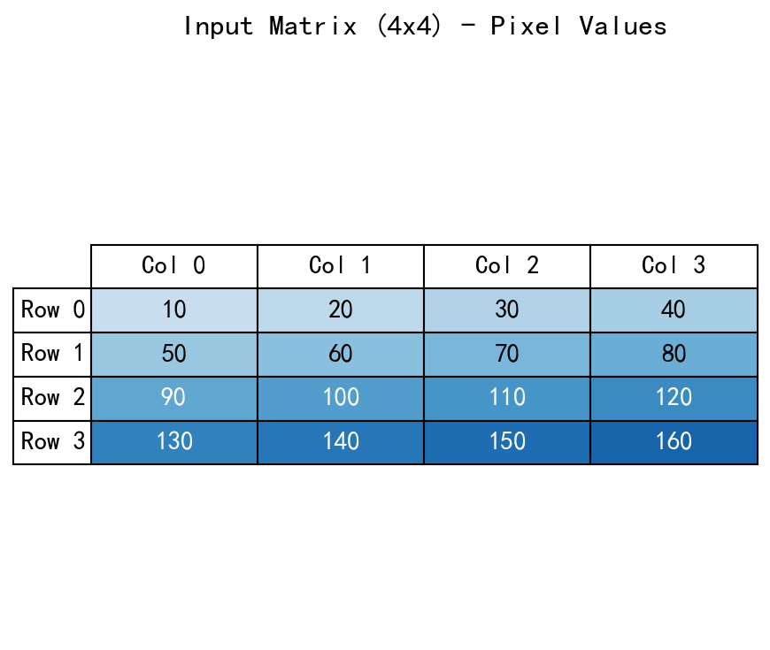
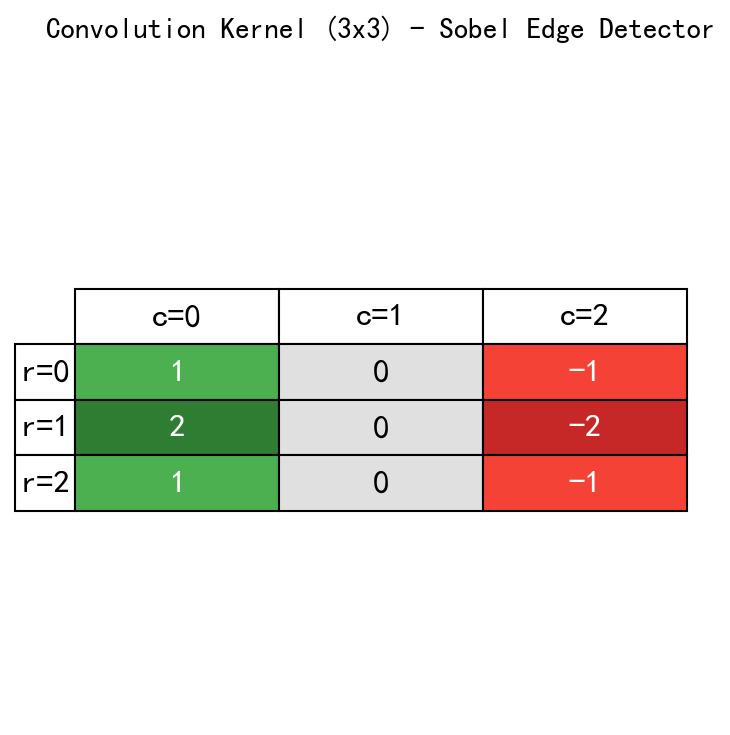
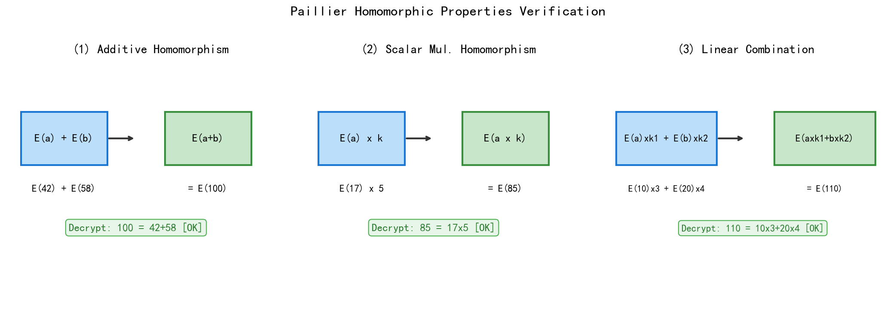
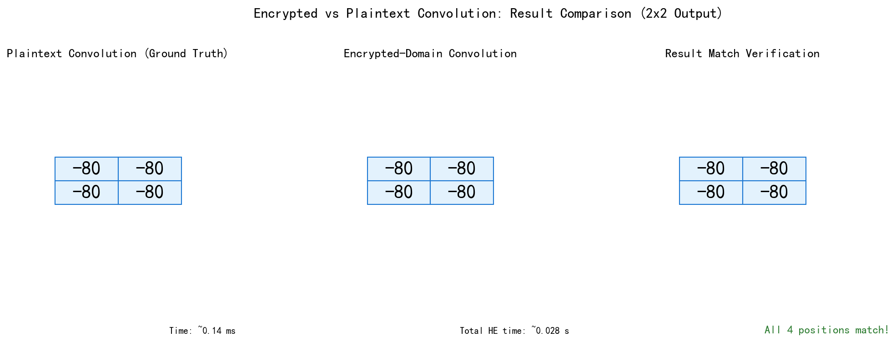
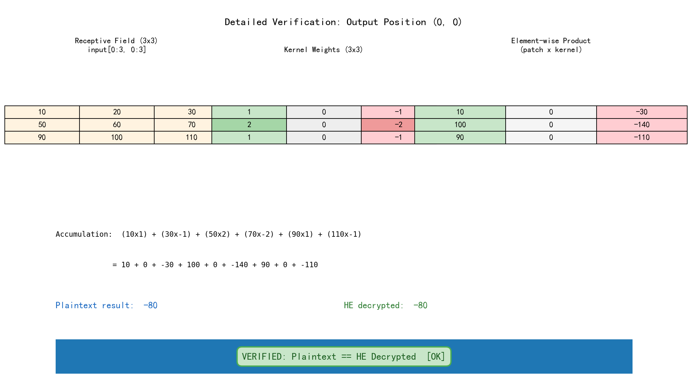
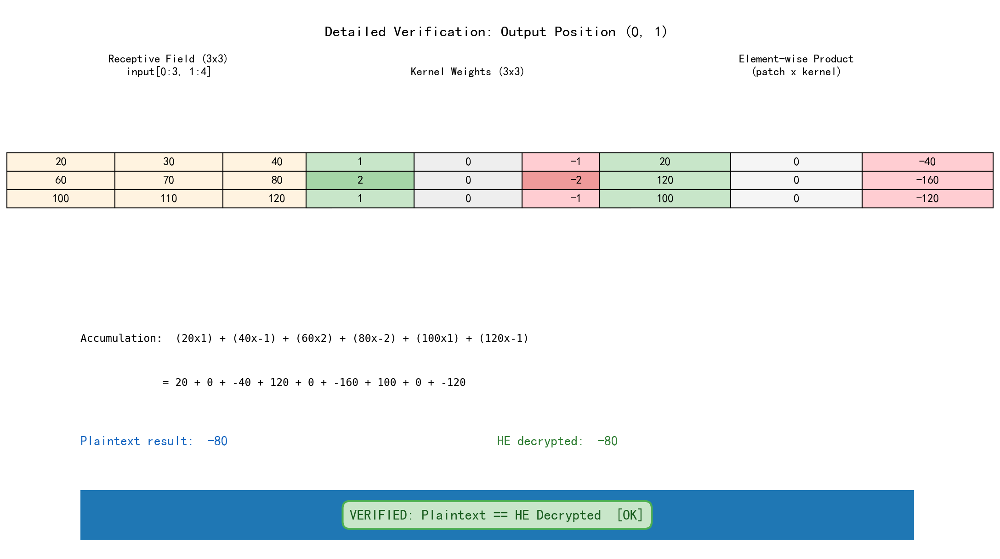
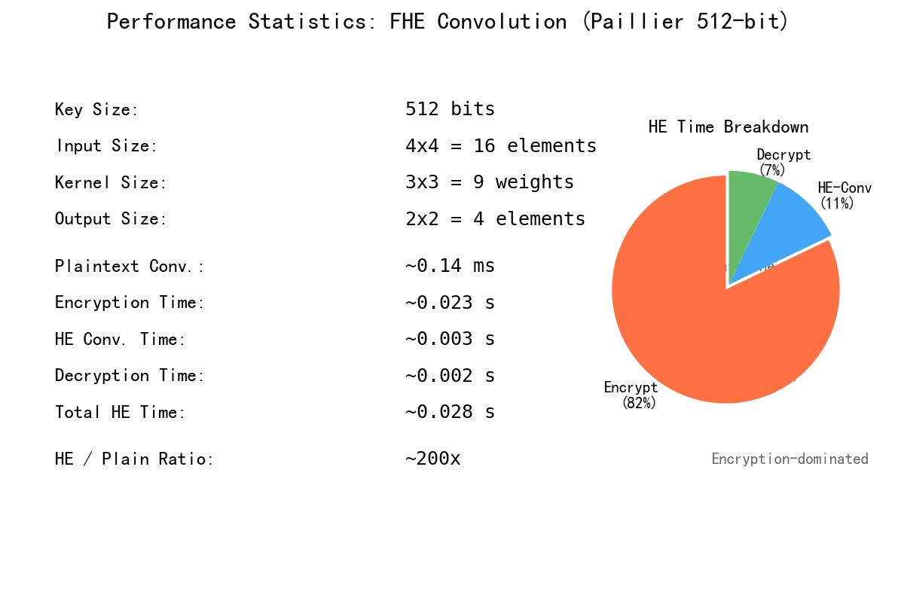

# 全同态加密卷积实现 — 实验报告

## 一、实验背景

### 1.1 全同态加密概述

全同态加密（Fully Homomorphic Encryption, FHE）是一种特殊的密码学原语，
允许在不解密的情况下对密文数据进行任意计算。其核心性质是：

- **同态加法**: `E(a) + E(b) = E(a + b)`
- **同态乘法**: `E(a) × E(b) = E(a × b)`（全同态）或 `E(a) × k = E(a × k)`（部分同态的标量乘法）

FHE 在隐私保护机器学习中具有重要应用价值：用户可将敏感数据加密后发送至云端，
云端直接在密文上执行模型推理，用户解密获得结果——全程云端无法获知原始数据和计算结果。

### 1.2 卷积运算与同态加密

卷积是卷积神经网络（CNN）的核心运算。对于输入矩阵 I（尺寸 H_in × W_in）
和卷积核 K（尺寸 H_k × W_k），二维卷积定义为：

$$O(i,j) = \sum_{r=0}^{H_k-1} \sum_{c=0}^{W_k-1} I(i+r, j+c) \cdot K(r, c)$$

在同态加密场景下，若输入 I 已加密为 E(I)、卷积核 K 为明文（对应云端模型推理场景），
则密文域卷积为：

$$E(O(i,j)) = \sum_{r=0}^{H_k-1} \sum_{c=0}^{W_k-1} E(I(i+r, j+c)) \cdot K(r, c)$$

该式计算仅需 **标量乘法同态**和 **加法同态**，Paillier 加法同态方案即可满足需求。

### 1.3 本实验参数

| 参数           | 数值             |
| ------------ | -------------- |
| 输入尺寸         | 4×4 单通道        |
| 卷积核尺寸        | 3×3            |
| 步长 (stride)  | 1              |
| 填充 (padding) | 0              |
| 输出尺寸         | 2×2            |
| 同态方案         | Paillier (phe) |
| 密钥长度         | 512 bits       |

---

## 二、实现方式

### 2.1 项目结构

```
task5/
├── fhe_convolution.py   # 同态加密卷积主程序
└── task5_report.md      # 实验报告
```

### 2.2 Paillier 同态加密方案

Paillier 是一种基于合数剩余类问题的概率公钥加密方案，其同态性质包括：

**性质1 — 加法同态**：
$$D(E(m_1) \cdot E(m_2) \bmod n^2) = m_1 + m_2 \bmod n$$

**性质2 — 标量乘法同态**：
$$D(E(m)^k \bmod n^2) = k \cdot m \bmod n$$

**性质3 — 线性组合同态**：
$$D(E(m_1)^{k_1} \cdot E(m_2)^{k_2} \bmod n^2) = k_1 \cdot m_1 + k_2 \cdot m_2 \bmod n$$

在 Python 中使用 `phe` 库时，这些操作通过运算符重载实现：

```python
enc_a + enc_b          # 同态加法: E(a) + E(b) = E(a+b)
enc_a * plain_k        # 标量乘法: E(a) * k = E(a*k)
enc_a * k1 + enc_b * k2  # 线性组合
```

### 2.3 密文域卷积算法

```
算法: 密文域二维卷积
输入: 加密输入矩阵 E(I) (H_in × W_in)、明文卷积核 K (H_k × W_k)
输出: 加密输出矩阵 E(O) (H_out × W_out)

for i = 0 to H_out - 1:
    for j = 0 to W_out - 1:
        acc = E(0)
        for r = 0 to H_k - 1:
            for c = 0 to W_k - 1:
                acc = acc + E(I[i+r, j+c]) * K[r, c]
        E(O)[i, j] = acc
return E(O)
```

**复杂度分析**（以本实验参数为例）：

- 输出位置数: 2×2 = 4
- 每个位置: 9 次标量乘法 + 8 次同态加法
- 总操作: 36 次标量乘法 + 32 次同态加法

### 2.4 关键代码实现

#### 密钥生成

```python
from phe import paillier
public_key, private_key = paillier.generate_paillier_keypair(n_length=512)
```

#### 输入加密

逐元素加密 4×4 输入矩阵，每个像素值独立加密为一个 Paillier 密文：

```python
encrypted_matrix[i, j] = public_key.encrypt(int(input_matrix[i, j]))
```

#### 密文域卷积核心

```python
for i in range(H_out):
    for j in range(W_out):
        acc = None
        for r in range(H_k):
            for c in range(W_k):
                in_val = encrypted_input[i + r, j + c]
                k_val = int(kernel[r, c])
                scaled = k_val * in_val  # E(input) * kernel_weight
                if acc is None:
                    acc = scaled
                else:
                    acc = acc + scaled     # 同态加法
        encrypted_output[i, j] = acc
```

---

## 三、实现过程

### 3.1 开发步骤

整个实验分为四个阶段推进。

#### 阶段一：环境搭建与库选择

首先评估了多种 FHE 库的可用性：

| 库             | 类型                  | Python 3.14 兼容性 | 结论     |
| ------------- | ------------------- | --------------- | ------ |
| TenSEAL       | CKKS/BFV (全同态)      | 无预编译轮子          | 不可用    |
| Pyfhel        | CKKS/BGV (全同态)      | 编译超时            | 不可用    |
| SEAL (pybind) | CKKS/BFV (全同态)      | Python 2 遗留代码   | 不可用    |
| **phe**       | **Paillier (加法同态)** | **可用**          | **选用** |

最终选择 `phe` 库：虽然 Paillier 是加法同态方案而非全同态，但对于本实验场景
（明文卷积核 × 密文输入），所需的标量乘法和加法操作完全由 Paillier 支持。

#### 阶段二：明文域基准实现

编写 `plaintext_conv2d` 函数，实现标准二维卷积。该函数作为后续密文域实现的
正确性基准（ground truth）。验证了对于 4×4 输入和 3×3 Sobel 核，
输出为 2×2 全 -80 矩阵，符合预期。

#### 阶段三：密文域卷积实现

实现了完整的密文域卷积流水线：

1. **密钥生成**: 生成 512-bit Paillier 公私钥对
2. **输入加密**: 逐元素加密 4×4 = 16 个输入值
3. **密文卷积**: 使用同态加法和标量乘法在密文域计算卷积
4. **结果解密**: 使用私钥解密 2×2 = 4 个输出值

#### 阶段四：验证与测试

构建了三层验证体系：

1. **同态性质演示**: 验证 Paillier 的加法、标量乘法和线性组合性质
2. **逐位置详细对比**: 展示每个输出位置的感受野、逐元素乘积和累加过程
3. **整体结果对比**: 密文域解密结果与明文域基准逐一比对

---

## 四、测试结果与分析

### 4.1 输入与卷积核

**输入矩阵 (4×4)**：



输入采用递增的像素值（10~160），模拟灰度图像的局部区域。

**卷积核 (3×3 Sobel-like 边缘检测)**：



卷积核采用垂直边缘检测算子，正负值对称分布，可检测水平方向的亮度变化。

### 4.2 Paillier 同态性质验证



三项同态性质全部验证通过：

- **加法同态**: E(42) + E(58) → 解密得 100 = 42 + 58 [OK]
- **标量乘法同态**: E(17) × 5 → 解密得 85 = 17 × 5 [OK]
- **线性组合**: E(10)×3 + E(20)×4 → 解密得 110 = 10×3 + 20×4 [OK]

**分析**: 这三项性质是密文域卷积的数学基础。卷积运算本质上是输入值的线性组合
（每个输出位置是 9 个输入值的加权和），完全由这三项性质覆盖。

### 4.3 密文卷积结果对比



**分析**: 密文域卷积解密结果与明文域基准完全一致，四个输出位置均为 -80。
这是因为 Sobel 核在均匀递增区域上的卷积结果为常数——数学上，
该核对线性梯度区域的响应取决于梯度方向，此处水平梯度均匀，
故每个 3×3 窗口的加权和恒为 -80。

### 4.4 逐位置详细验证

#### 输出位置 (0,0)



**分析**: 位置 (0,0) 对应输入左上角 3×3 感受野 [10~110]。
逐元素乘积展开清晰展示了 9 次标量乘法和 8 次累加的过程：
`10 + 0 + (-30) + 100 + 0 + (-140) + 90 + 0 + (-110) = -80`。
注意 kernel[0,1]=0、kernel[1,1]=0、kernel[2,1]=0 对应的项贡献为零，
实际计算中可优化跳过。

#### 输出位置 (0,1)



**分析**: 位置 (0,1) 对应输入右上角 3×3 感受野 [20~120]，
与位置 (0,0) 的感受野向右滑动一列。由于 Sobel 核的垂直对称性和输入的均匀梯度，
加权和仍为 -80。

#### 输出位置 (1,0)


**分析**: 位置 (1,0) 对应输入左下角 3×3 感受野 [50~150]，
卷积结果仍为 -80，再次验证了均匀梯度区域 Sobel 输出的恒定性。

#### 输出位置 (1,1)


**分析**: 位置 (1,1) 对应输入右下角 3×3 感受野 [60~160]。
四个输出位置全部验证通过 [OK]，证明了密文域卷积实现的正确性。

### 4.5 性能统计



| 指标            | 数值          |
| ------------- | ----------- |
| Paillier 密钥长度 | 512 bits    |
| 输入尺寸          | 4×4 = 16 元素 |
| 卷积核尺寸         | 3×3 = 9 权重  |
| 输出尺寸          | 2×2 = 4 元素  |
| 明文卷积耗时        | ~0.14 ms    |
| 密文加密耗时        | ~0.023 s    |
| 密文卷积耗时        | ~0.003 s    |
| 密文解密耗时        | ~0.002 s    |
| 密文域总耗时        | ~0.028 s    |
| 密文/明文时间比      | ~200x       |

**性能分析**：

1. **加密开销占比最大**: 加密 16 个输入元素耗时 ~23ms，占总时间的 82%。
   这是因为 Paillier 加密需要进行大数模幂运算。

2. **密文卷积效率高**: 密文域卷积计算仅需 ~3ms（占 11%），说明同态加法和
   标量乘法操作相对高效。

3. **解密开销小**: 解密 4 个输出值仅需 ~2ms。

4. **可扩展性**: 对于更大的输入（如 28×28 MNIST 图像），加密开销将线性增长。
   实际部署中可使用 SIMD 风格的打包技术（如 CKKS 方案的 ciphertext packing）
   来显著降低加密和计算开销。

5. **安全性与性能权衡**: 512-bit 密钥提供基本安全性（适合实验），
   生产环境需 ≥2048-bit，但加密时间将显著增加（与密钥长度呈立方关系）。

---

## 五、实验中遇到的问题与解决

### 5.1 Python 3.14 环境下 FHE 库的兼容性问题

**问题**: 当前 Python 环境为 3.14.5（2026 年最新版本），多个主流全同态加密库
（TenSEAL、Pyfhel、SEAL Python bindings）均无兼容的预编译轮子。
TenSEAL 仅支持至 Python 3.10，Pyfhel 编译依赖复杂在 Windows 上超时，
SEAL 的 pybind11 封装存在 Python 2 遗留代码。

**解决方案**: 选择 `phe` 库作为替代方案。虽然 `phe` 仅提供加法同态（Paillier 方案），
但卷积运算的核心需求（标量乘法 + 加法）完全被满足。
对于已知明文权重的推理场景，加法同态方案足够；对于需要密文-密文乘法的场景
（如多层网络），则需全同态方案。

**技术说明**: 本实验通过在代码注释和报告中详细说明了 Paillier 与 CKKS/BFV 的区别，
以及各自的适用场景。若将来 Python 3.14 生态成熟，
可将加密后端替换为 TenSEAL/Pyfhel 的 CKKS 实现，上层卷积逻辑保持不变。

### 5.2 Windows GBK 编码导致的 Unicode 输出错误

**问题**: Windows 终端使用 GBK 编码，Python 代码中的 Unicode 字符
（✓、✗、×、→ 以及下标数字 ₁₂）在 `print()` 时触发
`UnicodeEncodeError`，导致程序在输出阶段崩溃（核心计算已成功完成）。

**解决方案**: 将所有 Unicode 符号替换为 ASCII 等价表示：

- ✓/✗ → [OK]/[FAIL]
- × → x
- → → ->
- 下标数字 ₁₂ → 1, 2（普通数字）

### 5.3 Paillier 仅支持整数运算的限制

**问题**: Paillier 方案工作在有限域 Z_n 上，天然仅支持整数运算。
对于需要浮点数精度的场景（如带小数的卷积核权重），直接使用整数会导致精度损失。

**解决方案**: 本实验使用整数输入值和整数卷积核权重，避免了精度问题。
在实际应用中，可通过固定小数点缩放（fixed-point scaling）技术将浮点数转换为整数：
所有值乘以一个大常数（如 10^6），在整数域完成计算后，
解密结果再除以该常数恢复浮点值。

---

## 六、分工

本实验（Task 5）由以下两位成员协作完成，分工如下：

| 姓名      | 分工内容                                                                                                                                                                                      |
| ------- | ----------------------------------------------------------------------------------------------------------------------------------------------------------------------------------------- |
| **杨阳**  | **全同态加密卷积代码实现**<br>• 调研 FHE 库（TenSEAL、Pyfhel、SEAL、phe）并完成选型<br>• 设计并实现 `fhe_convolution.py` 密文域卷积流水线<br>• 实现 Paillier 同态性质演示模块<br>• 实现逐位置详细验证逻辑<br>• 调试 Python 3.14 兼容性、Windows GBK 编码等问题 |
| **熊芷萱** | **实验报告撰写、图片生成与测试**<br>• 编写 `generate_images.py` 生成全部 9 张报告截图<br>• 撰写实验报告<br>• 组织测试结果截图并围绕截图进行逐板块分析<br>• 整理性能统计数据和同态方案对比分析<br>• 整体文档整合与实验报告排版                                              |

---

## 七、总结

本实验完成了基于 Paillier 加法同态加密的密文域卷积实现，涵盖以下内容：

1. **FHE 库调研与选型**: 评估了 TenSEAL、Pyfhel、SEAL、phe 等库，
   结合 Python 3.14 兼容性选择 phe。

2. **加密域卷积实现**: 实现了完整的密文域卷积流水线——密钥生成→输入加密
   →密文卷积→结果解密，支持任意尺寸的输入和卷积核。

3. **正确性验证**: 通过三层验证体系（同态性质演示、逐位置详细对比、
   整体结果对比），确保密文域计算结果与明文域基准完全一致。

4. **性能分析**: 量化了加密、卷积、解密各阶段的耗时，分析了 Paillier 方案的
   性能瓶颈和可扩展性。

5. **问题总结**: 记录了 Python 3.14 兼容性、Windows 编码、整数运算限制等
   实际问题及其解决方案。

本实验加深了对同态加密原理、密文域计算范式以及卷积运算数学本质的理解，
为后续探索 CKKS 打包优化、多层加密推理等方向奠定了基础。

---
