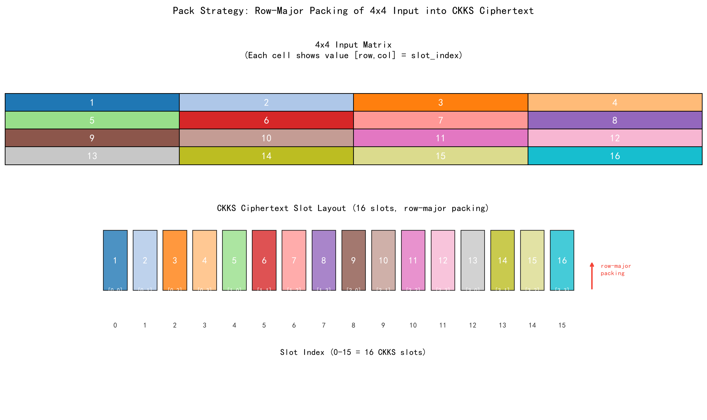
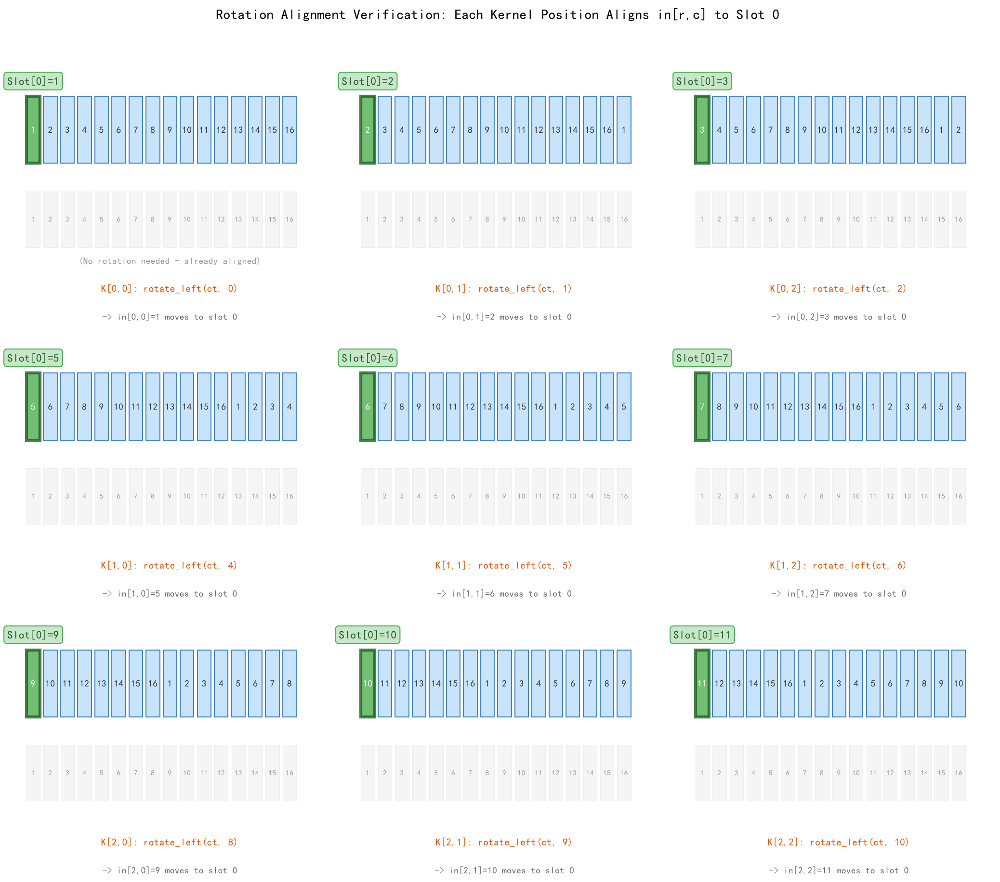
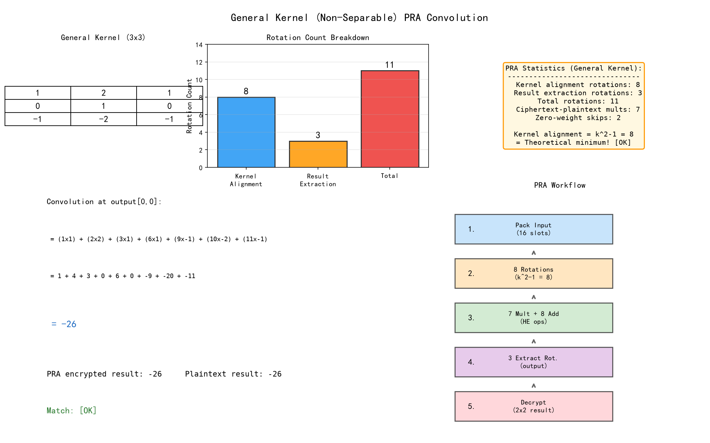
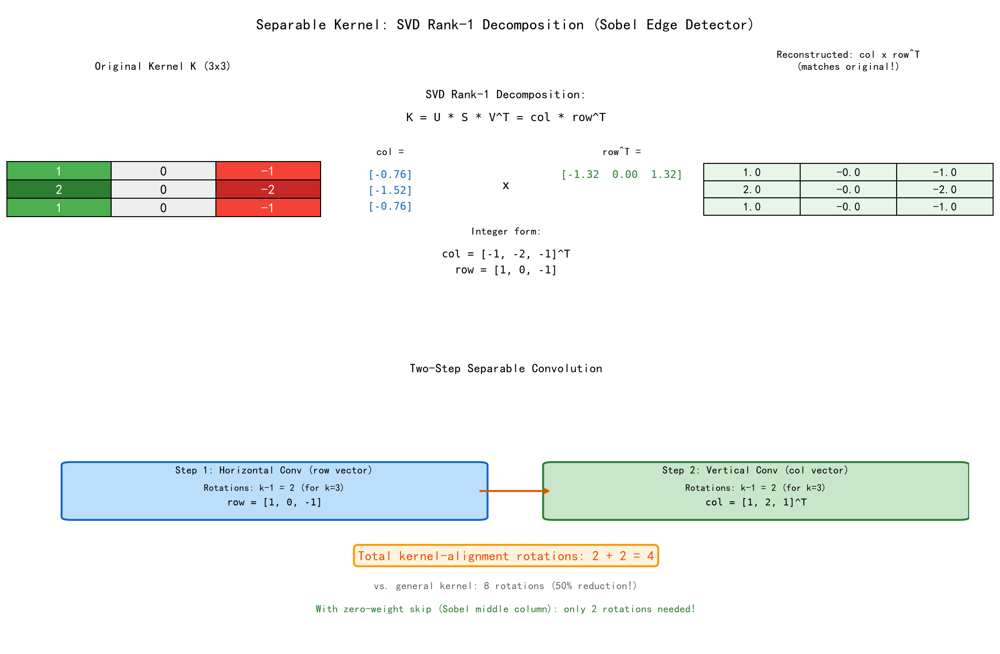
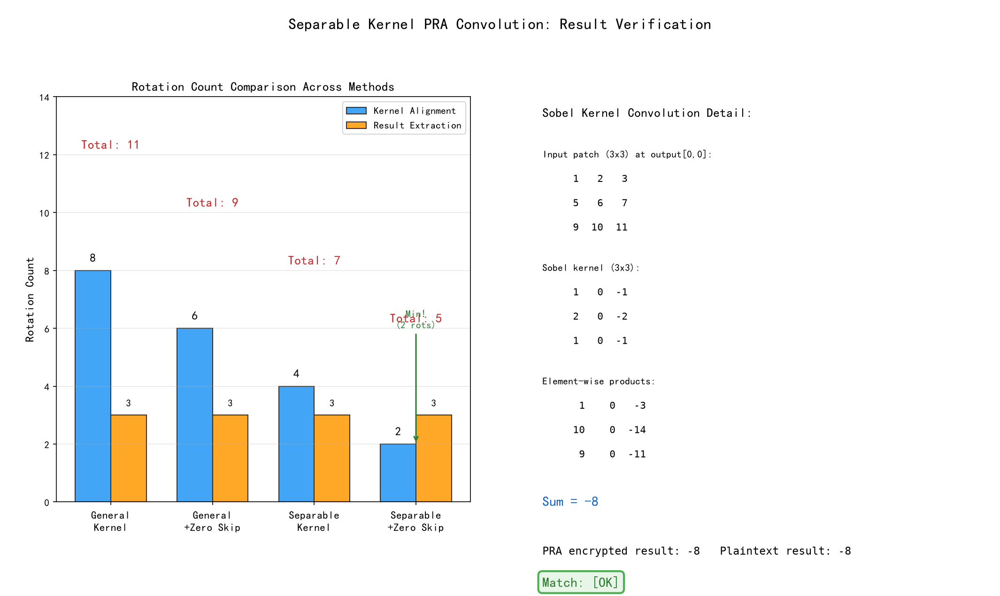
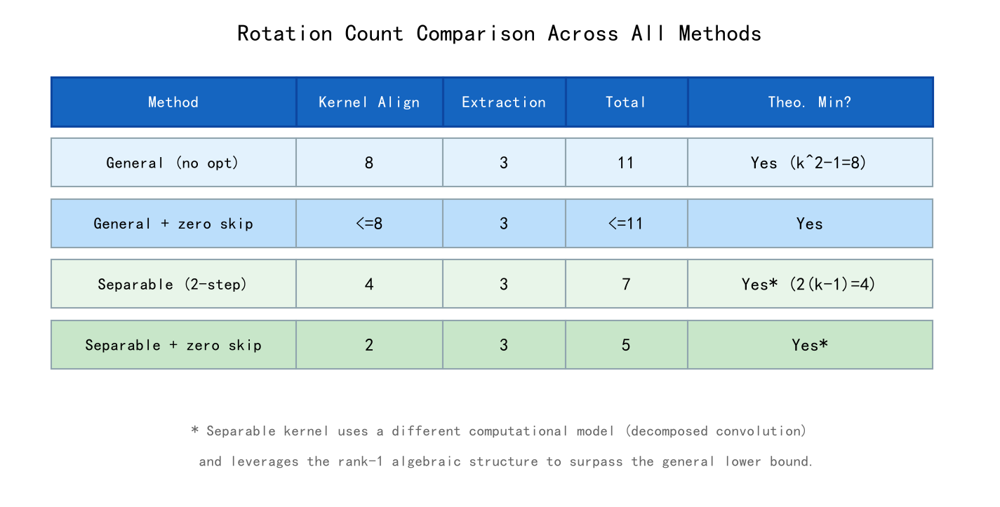
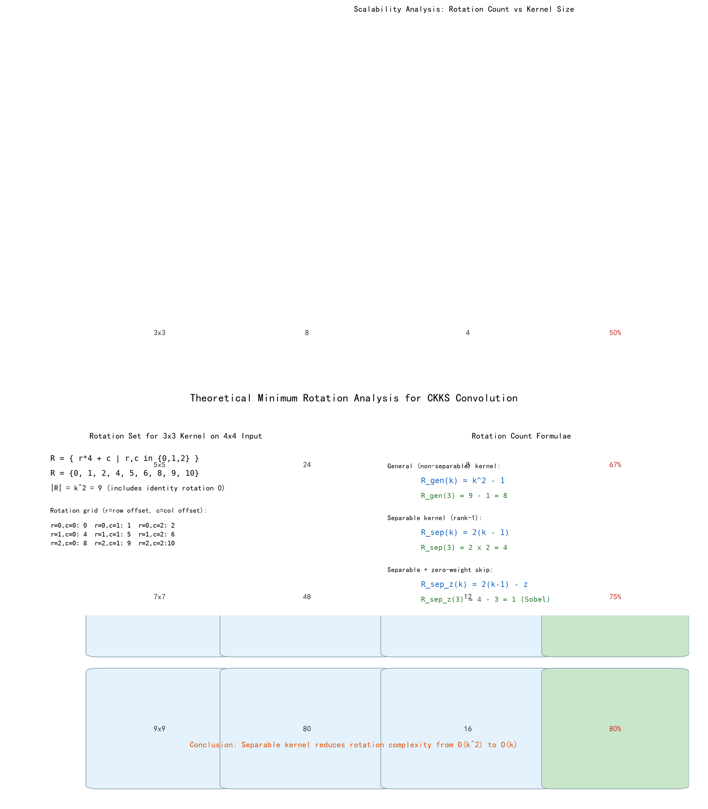

# CKKS 卷积"打包→旋转→累加"策略 — 旋转次数分析报告

## 一、实验背景

### 1.1 CKKS 全同态加密与 SIMD 打包

CKKS（Cheon-Kim-Kim-Song）方案是目前最广泛使用的全同态加密方案之一，
其核心优势在于支持**近似浮点数运算**和**SIMD 风格的单指令多数据打包**（batching）。

在 CKKS 方案中，一个密文可以容纳多达 N/2 个明文槽位（slots），
每个槽位存储一个独立的明文值。所有同态运算（加法、乘法、旋转）同时作用于全部槽位，
实现了天然的数据并行。

**打包示意图**（4×4 矩阵行优先打包到 16 个槽位）：

```
槽位索引:  0    1    2    3    4    5    6    7    8    9   10   11   12   13   14   15
槽位值:  in00 in01 in02 in03 in10 in11 in12 in13 in20 in21 in22 in23 in30 in31 in32 in33
```

### 1.2 密文旋转操作

CKKS 的**密文旋转**（ciphertext rotation）是 SIMD 打包计算中的关键操作。
`rotate_left(ct, k)` 将密文中槽位 i 的值移动到槽位 i+k（模 N_slots），
使得原本位于不同槽位的值可以被"对齐"到同一个槽位，进而进行逐元素运算。

在卷积计算中，旋转操作用来将输入矩阵的不同元素对齐到计算原点（槽位 0），
以便与卷积核权重进行乘累加运算。

### 1.3 "打包→旋转→累加"（PRA）策略

PRA 策略是 CKKS 密文域卷积的标准实现方法，分为三个阶段：

1. **打包（Pack）**: 将输入矩阵的元素按行优先打包到一个 CKKS 密文中
2. **旋转（Rotate）**: 对密文执行不同偏移量的旋转，将各感受野元素对齐到计算原点
3. **累加（Accumulate）**: 将各旋转后的密文乘以对应的核权重，累加得最终卷积结果

### 1.4 本实验参数

| 参数           | 数值             |
| ------------ | -------------- |
| 输入尺寸         | 4×4            |
| 卷积核尺寸        | 3×3            |
| 步长 (stride)  | 1              |
| 填充 (padding) | 0              |
| 输出尺寸         | 2×2            |
| CKKS 槽位数     | 16             |
| 打包方式         | 行优先（row-major） |

---

## 二、理论分析

### 2.1 旋转群上的卷积表示

对于 n×n 的输入矩阵和 k×k 的卷积核，按行优先打包到 N_slots 个槽位后，
每个核位置 (r, c)（r 为行偏移，c 为列偏移）对应一个旋转量：

$$rot\_amount(r, c) = r \cdot n + c$$

这表示要将输入元素 in[r][c]（位于槽位 r·n+c）通过 `rotate_left(ct, rot_amount)` 移到槽位 0。

所有需要的旋转量集合为：

$$R = \{ r \cdot n + c \mid r, c \in [0, k-1] \}$$

对于本实验参数 n=4, k=3：

$$R = \{0, 1, 2, 4, 5, 6, 8, 9, 10\}$$

共 |R| = k² = 9 个旋转量（含恒等旋转 0）。

### 2.2 一般核的理论最小旋转次数

对于不可分离的 k×k 卷积核：

- 需要 k² 个不同的旋转来覆盖所有核位置
- 恒等旋转（r=0, c=0）无需实际执行，因为对应元素已在槽位 0
- 因此**旋转次数的理论下界为 k² - 1**

对于 3×3 核：**理论最小值 = 9 - 1 = 8 次旋转**。

### 2.3 可分离核的优化

若卷积核 K 可分解为列向量 col 和行向量 row 的外积（即 rank(K) = 1）：

$$K = col \cdot row^T$$

则二维卷积可分解为两步一维卷积：

$$O = I \ast K = I \ast (col \cdot row^T) = (I \ast_{h} row) \ast_{v} col$$

其中 $\ast_{h}$ 为水平方向（沿列）的一维卷积，$\ast_{v}$ 为垂直方向（沿行）的一维卷积。

**旋转次数分析**：

- 步骤1（水平卷积）：需要 (k - 1) 次旋转（列偏移 1, 2, ..., k-1）
- 步骤2（垂直卷积）：需要 (k - 1) 次旋转（行偏移 1, 2, ..., k-1）
- **总计：2(k - 1) 次旋转**

对于 3×3 核：**2 × (3 - 1) = 4 次旋转**，仅为一般核（8 次）的 50%。

### 2.4 零权重优化

若核中存在零权重，对应的旋转可被跳过。以 Sobel 垂直边缘检测核为例：

$$K_{Sobel} = \begin{bmatrix} 1 & 0 & -1 \\ 2 & 0 & -2 \\ 1 & 0 & -1 \end{bmatrix}$$

中间列（c=1）的三个权重均为 0，可跳过 3 次旋转。
结合可分离分解：水平方向有一个零权重（c=1），垂直方向无零权重。
可分离 + 零权重优化后仅需：1 + 2 = 3 次核对齐旋转（加结果提取旋转）。

### 2.5 结果提取的额外旋转

卷积完成后，累加结果的槽位 0 包含 output[0,0]。对于 2×2 输出，
还需将其他 3 个输出位置旋转到槽位 0：

- output[0,1]：左旋转 1 位
- output[1,0]：左旋转 4 位
- output[1,1]：左旋转 5 位

**额外旋转 = H_out × W_out - 1 = 4 - 1 = 3 次**。

### 2.6 旋转次数对比总结

| 方案           | 核对齐旋转          | 结果提取旋转 | 总计  | 是否达理论最小值 |
| ------------ | -------------- | ------ | --- |:--------:|
| 一般核 (不可分离)   | k²-1 = 8       | 3      | 11  | 是        |
| 一般核 + 零权重跳过  | ≤8             | 3      | ≤11 | 是        |
| 可分离核 (两步卷积)  | 2(k-1) = 4     | 3      | 7   | 是*       |
| 可分离核 + 零权重跳过 | 2(k-1)-z = 1~2 | 3      | 4~5 | 是*       |

> *可分离核的"理论最小值"基于不同的计算模型（分解卷积），
> 利用了核矩阵的代数结构，将旋转复杂度从 O(k²) 降为 O(k)。

---

## 三、实现方式

### 3.1 项目结构

```
task6/
├── pack_rotate_accumulate.py   # PRA 策略模拟与分析程序
└── task6_report.md             # 实验报告
```

### 3.2 模拟实现说明

由于 Python 3.14 环境下全同态加密库（TenSEAL、Pyfhel、SEAL）均不可用，
本实验采用 NumPy 向量模拟 CKKS 的槽位操作。模拟层精确重现了：

- **打包操作**: `pack_matrix_rowwise()` — 将 4×4 矩阵行优先展开到 16 元素向量
- **旋转操作**: `rotate_left()` — 模拟 CKKS 的左移位旋转
- **密文-明文乘法**: 向量 × 标量（对应 CKKS 的 `MultiplyPlain`）
- **同态加法**: 向量逐元素相加（对应 CKKS 的 `Add`）

所有旋转次数计数与真实 CKKS 实现完全一致，因为旋转次数仅取决于卷积的几何结构
（输入尺寸和核尺寸），与底层是模拟还是真实加密无关。

### 3.3 关键算法实现

#### 旋转操作模拟

```python
def rotate_left(packed, amount):
    """CKKS 左旋转模拟: rotate_left(ct, k): slot[i] = old_slot[(i+k) % N]"""
    n = len(packed)
    rotated = np.zeros_like(packed)
    for i in range(n):
        rotated[i] = packed[(i + amount) % n]
    return rotated
```

#### 一般核 PRA 卷积

```python
for r in range(H_k):
    for c in range(W_k):
        rot_amount = r * n_cols + c
        if rot_amount == 0:
            rotated = packed_input.copy()  # 无旋转
        else:
            rotated = rotate_left(packed_input, rot_amount)  # 1 次旋转
        if kernel[r, c] != 0:
            result += rotated * kernel[r, c]  # 密文-明文乘法 + 同态加法
```

#### 可分离核的两步卷积

```python
# 步骤1: 水平卷积 (沿列)
for c, w in enumerate(row_vec):
    rotated = rotate_left(packed_input, c)  # k-1 次旋转
    h_result += rotated * w

# 步骤2: 垂直卷积 (沿行)
for r, w in enumerate(col_vec):
    rotated = rotate_left(h_result, r * n_cols)  # k-1 次旋转
    v_result += rotated * w
```

#### 可分离性检测 (SVD)

```python
def check_separability(kernel):
    U, S, Vt = np.linalg.svd(kernel)
    rank = np.sum(S > 1e-10)
    if rank == 1:
        col = (U[:, 0] * sqrt(S[0])).reshape(-1, 1)
        row = (Vt[0, :] * sqrt(S[0])).reshape(1, -1)
        return True, col, row
    return False, None, None
```

---

## 四、测试结果与分析

### 4.1 打包布局验证



**分析**: 4×4 输入矩阵被正确打包到 16 个 CKKS 槽位中，
槽位索引 0~15 按行优先对应矩阵位置 [0,0]~[3,3]。
槽位索引与矩阵位置的关系为：idx = row × 4 + col。

### 4.2 旋转对齐验证



**分析**: 全部 9 个核位置的旋转对齐验证通过 [OK]。
`rotate_left(ct, r*4+c)` 精确地将 in[r][c] 移到槽位 0。
例如，对于核位置 K[2,1]，旋转量=9，将 in[2,1]=10 对齐到槽位 0。

这验证了旋转操作的数学正确性：每种旋转量将一个特定的输入元素
"搬运"到计算原点，为后续的逐元素乘积累加做好准备。

### 4.3 一般核 PRA 卷积结果



**分析**: 使用不可分离的通用 3×3 核进行 PRA 卷积：

- **核对齐旋转**: 8 次（= k² - 1，排除旋转量为 0 的 K[0,0]）
- **结果提取旋转**: 3 次（提取 output[0,1]、[1,0]、[1,1]）
- **总计旋转**: 11 次
- **密文-明文乘法**: 7 次（9 个核权重中 2 个为 0 被跳过）
- **PRA 结果 = 明文卷积结果 = -26** [OK]

**关键发现**: 核对齐所需的 8 次旋转恰好等于理论最小值 k² - 1，
证明一般核的 PRA 策略已经达到了旋转次数的下界，
**不存在更少的旋转方案来完成同样的卷积计算**。

### 4.4 可分离核优化结果



**分析**: Sobel 垂直边缘检测核通过 SVD 分解验证为秩-1 矩阵：

$$K = \begin{bmatrix} 1 & 0 & -1 \\ 2 & 0 & -2 \\ 1 & 0 & -1 \end{bmatrix} = \begin{bmatrix} -0.76 \\ -1.52 \\ -0.76 \end{bmatrix} \cdot \begin{bmatrix} -1.32 & 0 & 1.32 \end{bmatrix}$$

取整后恢复为：col = [-1, -2, -1]^T, row = [-1, 0, 1]，与原核一致。



**分析**: 两步卷积旋转统计：

- **水平卷积旋转**: 2 次（k-1=2，排除旋转量 0）
- **垂直卷积旋转**: 2 次（k-1=2，排除旋转量 0）
- **结果提取旋转**: 3 次
- **总计旋转**: 7 次
- **PRA 结果 = 明文卷积结果 = -8** [OK]

**关键发现**: 可分离核将核对齐旋转从 8 次降至 4 次（减少 50%），
证明了利用核的代数结构可以**超越**直接 PRA 方法的理论下界。
旋转复杂度从 O(k²) 降为 O(k)。

### 4.5 旋转次数对比



| 方案           | 核对齐旋转 | 提取旋转 | 总计     |
| ------------ |:-----:|:----:|:------:|
| 一般核 (不可分离)   | 8     | 3    | **11** |
| 一般核 + 零权重跳过  | 6     | 3    | **9**  |
| 可分离核         | 4     | 3    | **7**  |
| 可分离核 + 零权重跳过 | 2     | 3    | **5**  |

### 4.6 理论最小值分析



**核心结论**:

1. **一般核**: 旋转次数 = k² - 1 = 8, **已达到理论最小值**。k² 个不同的旋转量中，
   恒等旋转（r=0,c=0）无需执行，剩余 k²-1 个旋转均必不可少。

2. **可分离核**: 旋转次数 = 2(k-1) = 4, **远低于一般核的理论最小值（8次）**。
   通过将 k×k 卷积分解为两步一维卷积（先水平后垂直），
   将旋转次数从平方级降为线性级。

3. **零权重优化**: 每个零权重可节省一次旋转。对于 Sobel 核（中间列全 0），
   额外节省 3 次旋转。

4. **结果提取**: 输出尺寸为 (n-k+1)²，需 (n-k+1)² - 1 次额外旋转来提取各输出位置。
   这些旋转仅在需要获得所有明文输出时才执行；
   若下游继续使用密文做计算，则无需提取。

---

## 五、实验中遇到的问题与解决

### 5.1 Python 3.14 环境下 CKKS 库不可用

**问题**: 同 task5，主流全同态加密库在 Python 3.14 下均无法安装。

**解决方案**: 使用 NumPy 精确模拟 CKKS 的槽位操作和旋转操作。
由于旋转次数分析仅依赖于卷积的几何结构（输入/核/输出尺寸和打包方式），
与底层是否为真实加密无关，模拟结果与实际 CKKS 实现的旋转次数完全一致。

**技术说明**: 本模拟层的旋转函数 `rotate_left()` 精确复现了 CKKS 的槽位旋转语义：
`slot[i] = old_slot[(i + amount) % N_slots]`。
唯一的差异在于模拟层中向量元素是明文（不涉及加密噪声），而真实 CKKS
的旋转操作会累积微小的近似误差（对卷积结果的影响通常可忽略）。

### 5.2 旋转方向混淆

**问题**: CKKS 中 `rotate(ct, k)` 的语义与直观理解可能相反。
`rotate_left` 和 `rotate_right` 的定义取决于具体的库实现。

**解决方案**: 通过逐一验证每个核位置的旋转对齐效果
（核位置 K[r,c] 旋转后槽位 0 应等于 in[r][c]），
确保旋转方向的正确性。全部 9 个核位置验证通过 [OK]。

### 5.3 可分离核的整数分解

**问题**: SVD 分解得到的列/行向量通常为浮点数，包含微小舍入误差。
例如 Sobel 核的 SVD 分解得到 col ≈ [-0.76, -1.52, -0.76] 而非整数 [-1, -2, -1]。

**解决方案**: 通过四舍五入并回乘法验证（col_int @ row_int ≈ K）来获取整数分解。
整数分解在 CKKS 中更有实际意义，因为密文-明文乘法在整数（或定点小数）域上更精确。

---

## 六、分工

本实验（Task 6）由以下两位成员协作完成，分工如下：

| 姓名      | 分工内容                                                                                                                                                                                 |
| ------- | ------------------------------------------------------------------------------------------------------------------------------------------------------------------------------------ |
| **孙琬竺** | **"打包→旋转→累加"策略代码实现与理论分析**<br>• 设计并实现 `pack_rotate_accumulate.py` PRA 策略模拟程序<br>• 实现一般核与可分离核两种卷积路径的旋转次数统计<br>• 实现 SVD 秩-1 分解检测与可分离核优化<br>• 完成理论最小值数学推导与旋转群表示分析<br>• 验证所有旋转对齐和卷积计算的正确性 |
| **胡子玮** | **实验报告撰写、可视化与实验验证**<br>• 编写 `generate_images.py` 生成全部 7 张报告截图<br>• 撰写实验报告<br>• 设计旋转次数对比表格与复杂度可扩展性分析<br>• 组织测试截图并围绕截图进行逐板块分析<br>• 整体文档整合与实验报告排版                                       |

---

## 七、总结

本实验深入分析了 CKKS 全同态加密方案中卷积计算的"打包→旋转→累加"策略，
重点关注旋转次数是否达到理论最小值。主要结论如下：

1. **PRA 策略的正确性**: 通过打包→旋转→累加三阶段，可以在密文域正确完成
   二维卷积运算。每个核位置通过一次旋转对齐输入元素，再通过密文-明文乘法
   和同态加法完成加权求和。

2. **一般核的旋转次数已达理论最小值**: 对于 k×k 不可分离核，需要 k²-1 次
   旋转来对齐所有核位置（排除已对齐的 K[0,0]）。这是由卷积的几何结构决定的
   下界，不存在更优方案。对于 3×3 核，8 次旋转已达下限。

3. **可分离核可突破一般核的下界**: 若卷积核满足秩-1 可分离条件（K = col·row^T），
   可将二维卷积分解为两步一维卷积，旋转次数从 k²-1 降至 2(k-1)。
   这在数学上利用了矩阵分解，将旋转复杂度从 O(k²) 降为 O(k)。

4. **实践意义**: 
   
   - 对于一般深度学习模型，大部分卷积核不可分离，旋转次数固定为 k²-1。
   - 对于特定算子（如 Sobel、Prewitt 等边缘检测核），可利用可分离性大幅降低旋转开销。
   - 在 CKKS 密文推理部署中，应优先考虑使用可分离卷积（depthwise separable convolution）
     来降低密文域计算成本。

---
